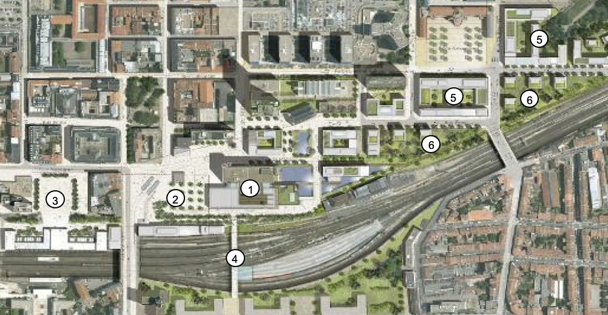
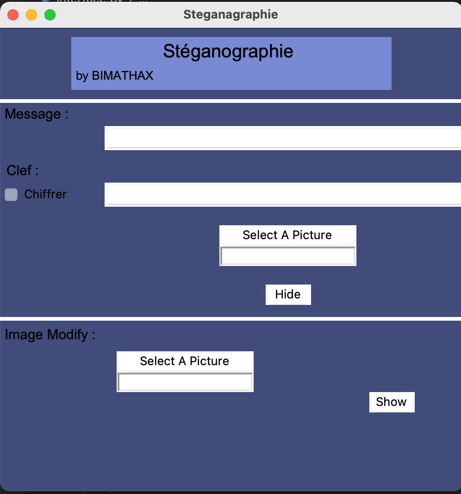

# Stenographie Picture

Ce code permet de cacher des messages dans une image. Par exemple :

> Image avant


> Image apres avoir inscrit Hello World like if you enjoy my script 


Il a 2 interfaces : graphique et en console
> Graphique



Comment Fonctionne-t-il ?
Il va modifier la couleur Blue (RGB) des cubes en haut à gauche de l'image et, pour éviter d'être trop vu, va calculer la moyenne de la ligne à laquelle il va ajouter la valeur de la lettre :
```sh
Cube_bleu 1 = moyenne + valeur_lettre
```
Cependant, pour rester le plus dans la moyenne, mon code va faire cela :
```sh
valeur : a -> +1
         b -> -1
         c -> +2
         d -> -2
         e -> +3
         ...
```
## Instalation
> Les modules dont vous aurez besoin

Pour utiliser mon code, tu auras besoin de : tkinter, Pillow, numpy et os

## Images
Image des modification sur une petite matrice
> Avant :


> Apres :


## Créateur :
Ce projet à été crée par BiMathAx STUDIO.
Vous pouvez me join par mail : bimathax.STUDIO@gmail.com
ou sur discord : BiMathAx#5514
